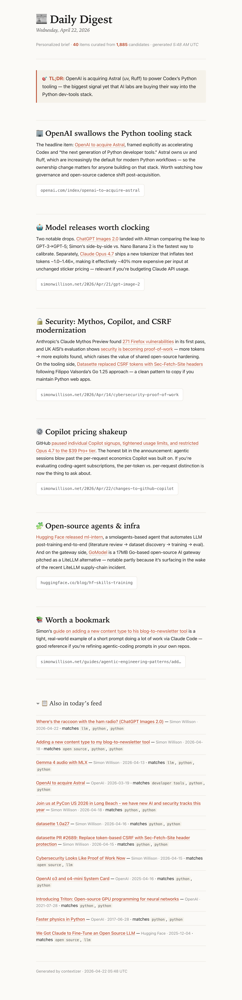

# contextizer — source collector + personalized daily digest



A small, local Python pipeline in two stages:

1. **Collect** — pulls from configured sources (RSS feeds, Slack channels), normalizes items, deduplicates, writes them to a configured sink (JSONL by default).
2. **Digest** — reads collected items, filters them against your personal profile, and emits a human-readable markdown brief (stub summarizer by default; any CLI-based LLM works as a drop-in).

Designed to run locally today and host later via cron / systemd / a small container.

## Install

```bash
cd contextizer
script/setup
```

That runs `script/bootstrap` (venv + deps), copies `.env.example` → `.env` if missing, and writes a skeleton `data/user_profile.md`. All `script/*` are idempotent and safe to re-run.

If you'd rather do it by hand:

```bash
python3.11 -m venv .venv && source .venv/bin/activate
pip install -r requirements.txt
cp .env.example .env
```

### Scripts

This project follows the [Scripts to Rule Them All](https://github.blog/engineering/engineering-principles/scripts-to-rule-them-all/) convention.

| Script | What it does |
|---|---|
| `script/bootstrap` | Create `.venv`, install dependencies. |
| `script/setup` | First-time setup: bootstrap + `.env` + skeleton profile. |
| `script/update` | Sync dependencies after pulling. |
| `script/server` | Run the continuous collect loop (`collect --loop`). |
| `script/digest` | Generate a digest for a group (defaults to `--today`). |
| `script/test` | Smoke tests: byte-compile, imports, CLI help, feeds.json parse. |

## Usage

### One-shot collect

```bash
python main.py collect --once                # collects every group in feeds.json
python main.py collect --once --group ai     # just one group
```

For each group, fetches every feed, deduplicates against `data/seen_items/{group}.json`, and appends new items to `data/raw/{group}.jsonl`.

### Continuous collect

```bash
python main.py collect --loop
```

Polls every `POLL_INTERVAL_MINUTES` (default 30). Ctrl-C stops cleanly.

### Generate a digest

```bash
script/digest ai                    # last 24h for group "ai"
script/digest general --since 3d    # last 3 days
script/digest ai --input data/raw/ai.jsonl
```

`script/digest` requires a group name and defaults to `--today` when no window is given. It's a thin wrapper over `python main.py digest` — fall back to the raw form if you need it. Writes to `data/digests/{group}/YYYY-MM-DD.md` by default. Override destination via `DIGEST_OUTPUT_TYPE` (`markdown`, `stdout`, `slack`).

### Feed groups

`data/feeds.json` organizes feeds into named groups. Each group has its own raw store, seen-items state, and digest output — so you can run, say, an AI digest daily and a general digest weekly, each against its own feed set.

```json
{
  "groups": {
    "ai": {
      "feeds": [{"url": "https://...", "name": "..."}, ...],
      "profile": "data/user_profile.md",
      "interests": "data/interests.json"
    },
    "general": {
      "feeds": [...]
    }
  }
}
```

`profile` / `interests` per-group are optional overrides — omit them to use the defaults from `.env`. The flat shape (`{"feeds": [...]}`) still works and is treated as a single `default` group.

### Digest target (workspace default + per-group override)

Digest output type and the Slack notify channel are configured in `data/feeds.json`. Set a workspace-wide default under `defaults.digest`, override per group under `groups.<name>.digest`:

```json
{
  "defaults": {
    "digest": {
      "output_type": "slack_pdf",
      "notify_channel": "#ai-feed"
    }
  },
  "groups": {
    "ai": { "feeds": [...] },
    "personal-digest": {
      "feeds": [...],
      "digest": {
        "output_type": "slack_canvas",
        "notify_channel": "C0ATQG87U22"
      }
    }
  }
}
```

- `output_type` — any of `markdown`, `html`, `stdout`, `slack`, `slack_canvas`, `slack_file`, `slack_pdf`. Falls back to `markdown` if neither default nor per-group is set.
- `notify_channel` — routes the `slack_canvas` / `slack_file` / `slack_pdf` sinks. Pass a channel ID (`C…`, `G…`), DM channel ID (`D…`), or user ID (`U…`, needs the `im:write` scope) to DM yourself.
- `prompt` — path to a markdown file with the LLM prompt template. Defaults to `templates/digest_prompt.md`. Swap to style the digest's *voice* (e.g. `templates/newspaper_prompt.md` for mock-broadsheet prose).
- `css` — path to the stylesheet used by the HTML / `slack_file` / `slack_pdf` sinks. Defaults to `templates/digest.css`. Pair with a matching prompt to get a cohesive look (see the `newspaper` preset).
- `extra_instructions` — free-form string (or array of strings joined with `\n`) injected into the base prompt as an "Additional guidance for this group" section. Use it to add rules without forking a whole prompt file: "always include a Research section," "downweight crypto," "keep bullets under 10 words," etc.
- `include_header` — `false` suppresses the pipeline's injected `# 📰 Daily Digest` + date + meta blockquote. Useful when your preset (e.g. newspaper) controls the top of the document itself.

Both the `defaults` block and the per-group `digest` block are optional. Per-group wins when both specify the same key.

### Style presets

Two paired prompt+CSS presets ship in `templates/`:

| Preset | Prompt | CSS | Vibe |
|---|---|---|---|
| magazine (default) | `digest_prompt.md` | `digest.css` | Tight newsletter brief with TL;DR + 3–6 emoji-headed topic paragraphs. |
| newspaper | `newspaper_prompt.md` | `newspaper.css` | Mock broadsheet — "The Daily Token," drop-capped lead, two-column spread, weather + classifieds. |

To switch a group to the newspaper preset, point its `digest.prompt` and `digest.css` at both files together — swapping one without the other reads badly. Copy either pair as a starting point for your own style.

### Sources beyond RSS

The `feeds` array inside a group accepts a couple of shapes. A string or `{"url": "..."}` entry is an RSS feed (default). A tagged entry with `"type"` selects a different source type. Today:

```json
{
  "groups": {
    "eng": {
      "feeds": [
        {"url": "https://react.dev/rss.xml", "name": "React"},
        {"type": "slack", "channel": "C0123456789", "name": "Slack #eng-announce"}
      ]
    }
  }
}
```

Slack source options:

| Key | Default | Purpose |
|---|---|---|
| `type` | — | Must be `"slack"`. |
| `channel` | — | Channel **ID** (e.g. `C0123456789`). Right-click the channel in Slack → *Copy link* and grab the trailing `C…`. Channel names (`#eng-announce`) are not accepted — the ID is stable, names aren't. |
| `name` | `Slack #<channel-name>` | Display label used as `Item.source` and shown in the digest. Resolved from Slack if omitted. |
| `include_threads` | `true` | When true, replies on a top-level message are folded into that Item's summary. |
| `lookback_hours` | `24` | How far back to scan on each collect. Extra belt-and-suspenders alongside dedup. |
| `filters` | `{}` | Optional per-channel content filters. See below. |
| `parse_files` | `false` | Download + extract text from PDF attachments and fold into the Item summary. See "PDF parsing" below. |

`filters` is a nested object with these optional keys:

| Key | Default | Purpose |
|---|---|---|
| `include_humans` | `true` | Drop messages authored by humans when `false`. |
| `include_bots` | `false` | Keep messages authored by bots (modern apps set `bot_id`; classic webhooks use `subtype: bot_message`). |
| `min_chars` | `0` | Drop messages whose raw text is shorter than this. |
| `include_pattern` | — | Regex; if set, only include messages whose text matches. |

Use-case example — a releases channel where humans post one-line deploy pings (`-> stg`, `-> prod`) but a release bot posts full notes:

```json
{"type": "slack", "channel": "C06KTEPAZ5Y", "filters": {
  "include_humans": false,
  "include_bots": true,
  "include_pattern": "Release Notes"
}}
```

#### PDF parsing

Setting `parse_files: true` on a Slack source enables PDF attachment extraction. When a message has one or more `.pdf` attachments, each is downloaded via `url_private` (using your existing `SLACK_BOT_TOKEN`), text is extracted via `pypdf`, and folded into the Item's summary as a `[Attached PDF: <name>]` block. The message body's 2000-char cap is preserved — extracted text is appended on top so a long PDF can't truncate the human content.

Shorthand `"parse_files": true` uses defaults; pass an object to tune:

```json
{"type": "slack", "channel": "C…", "parse_files": {
  "enabled": true,
  "max_file_mb": 5,
  "max_files_per_msg": 3,
  "max_text_chars": 4000
}}
```

| Key | Default | Purpose |
|---|---|---|
| `enabled` | `false` | Master toggle. |
| `max_file_mb` | `5` | Skip files larger than this. |
| `max_files_per_msg` | `3` | Cap PDFs processed per message. |
| `max_text_chars` | `4000` | Truncate extracted text to keep summaries reasonable. |

Limitations: image-only / scanned PDFs surface as `[image-only or unreadable PDF — text extraction skipped]` (no OCR). Encrypted PDFs are skipped. Externally-hosted attachments (Google Drive, Dropbox embeds) are ignored — they don't have a `url_private`.

Requires the `files:read` Slack scope (in addition to `channels:history` etc.) plus `pypdf>=4.0` (already in `requirements.txt`).

Slack channel sources need `SLACK_BOT_TOKEN` set and the bot invited to each channel (`/invite @your-bot`). Required scopes beyond the sink ones: `channels:history`, `channels:read`, `users:read` (public), plus `groups:history` + `groups:read` (private). If `SLACK_BOT_TOKEN` isn't set, any `type: slack` entry is skipped with a warning — RSS still runs.

> **Privacy callout.** Anything a Slack channel source reads flows into LLM prompts and may be re-published by whichever `DIGEST_OUTPUT_TYPE` is configured — Markdown files on disk, HTML, another Slack channel via Canvas/File, etc. Only add channels whose content you're comfortable routing through those destinations. Private channels in particular need deliberate opt-in and the `groups:*` scopes.

### Set up your profile

```bash
python main.py onboard --print-template   # prints templates/onboarding_prompt.md
python main.py onboard --init             # writes a skeleton data/user_profile.md
```

The onboarding prompt is designed to be run by an agent / LLM that interviews you and writes `data/user_profile.md` + `data/interests.json` based on your answers.

### Refine interests via Claude Code

If you use Claude Code in this repo, the `build-interests` skill (at `.claude/skills/build-interests/SKILL.md`) handles interest edits conversationally: say things like *"add MCP to my interests"*, *"build interests for the frontend group from this paragraph"*, or *"downrank crypto"* and the skill will update `data/interests.json` (or the right per-group file) and wire it into `data/feeds.json` if needed.

## Configuration

All config lives in `.env` (see `.env.example`). Key toggles:

| Env var | What it does |
|---|---|
| `RAW_OUTPUT_TYPE` | Where collected items go: `jsonl`, `directory`, `stdout`, `slack` |
| `SUMMARIZER` | `stub` (no LLM) or `llm` (pipe to `LLM_COMMAND`) |
| `LLM_COMMAND` | A shell command that reads the prompt on stdin and prints the digest to stdout. Examples: `claude -p`, `llm -m ...`, `ollama run ...` |
| `SLACK_WEBHOOK_URL` | Incoming webhook URL; required if any sink is `slack` |
| `SLACK_BOT_TOKEN` | Bot User OAuth token (`xoxb-…`); required for `slack_canvas`, `slack_file`, `slack_pdf` sinks AND for `type: slack` sources |

Digest output type and the Slack notify channel used to live here as `DIGEST_OUTPUT_TYPE` / `SLACK_CANVAS_NOTIFY_CHANNEL`. They moved to `data/feeds.json` — see **Per-group digest target** below.

## Slack setup

The Slack sinks need different credentials depending on what you're posting. In short:

| Sink | Needs | Delivers as |
|---|---|---|
| `slack` | `SLACK_WEBHOOK_URL` | Plain message via Incoming Webhook |
| `slack_canvas` | `SLACK_BOT_TOKEN` + `SLACK_CANVAS_NOTIFY_CHANNEL` | A Slack Canvas (rich, editable) |
| `slack_file` | `SLACK_BOT_TOKEN` + `SLACK_CANVAS_NOTIFY_CHANNEL` | HTML file upload |
| `slack_pdf` | `SLACK_BOT_TOKEN` + `SLACK_CANVAS_NOTIFY_CHANNEL` | Chromium-rendered PDF upload |

If you're only using the basic `slack` sink, skip to step 6 — the webhook setup is much simpler. For any of the `slack_*` sinks you need a bot token and the scopes below.

### 1. Create the Slack app

Go to <https://api.slack.com/apps>, click **Create New App → From scratch**, name it (e.g. "Contextizer"), and pick your workspace.

### 2. Add the scopes you need

Open **OAuth & Permissions** in the sidebar and scroll to **Scopes → Bot Token Scopes**. Add:

- `incoming-webhook` — required for the `slack` sink (the per-item forwarder and the plain digest sink).
- `canvases:write` + `chat:write` — required for the `slack_canvas` sink.
- `files:write` + `channels:read` — required for the `slack_file` and `slack_pdf` sinks.
- `channels:history` + `users:read` (+ `groups:history`, `groups:read` for private channels) — required if you use any `type: slack` source entries in `data/feeds.json`.
- `files:read` — required for PDF attachment parsing (`parse_files: true` on any Slack source).

It's fine to add all of them now if you might switch sink types later.

### 3. Install the app to your workspace

Still on **OAuth & Permissions**, click **Install to Workspace** at the top and approve. If you selected `incoming-webhook`, Slack will ask you to pick a channel during this step — pick the one you want the `slack` sink to post to. After install, copy the **Bot User OAuth Token** (starts with `xoxb-`) and the **Webhook URL** (under *Features → Incoming Webhooks* after install) — you'll paste both into `.env` in step 6.

### 4. Reinstall after any scope change

This trips everyone up: if you edit the scopes list *after* installing, Slack silently keeps your old grants until you reinstall. From **OAuth & Permissions**, click **Reinstall to Workspace** and re-approve. Your token doesn't change, but the scopes it carries do.

### 5. Invite the bot to the target channel

In Slack, open the channel you want the digest posted to and run:

```
/invite @Contextizer
```

(Substitute whatever you named the app.) The `slack_canvas` / `slack_file` / `slack_pdf` sinks all post on the bot's behalf, so the bot has to be a member of the channel — it won't get a useful error message if it isn't, just a permissions failure.

### 6. Fill in `.env`

```
# slack sink (webhook only)
SLACK_WEBHOOK_URL=https://hooks.slack.com/services/T000/B000/xxxxxxxx

# slack_canvas / slack_file / slack_pdf
SLACK_BOT_TOKEN=xoxb-...
SLACK_CANVAS_NOTIFY_CHANNEL=#ai-feed
```

Then flip the digest over:

```bash
DIGEST_OUTPUT_TYPE=slack_canvas python main.py digest --today --group ai
```

## Narrative mode (LLM summarizer)

By default the digest is a scored list — useful for filtering, not much more. To turn it into a narrative brief ("what of this is interesting to you, and in what aspects"), flip the summarizer:

```bash
SUMMARIZER=llm LLM_COMMAND="claude -p" python main.py digest --today --group ai
```

The `LLMSummarizer` shells out to any command that reads a prompt from stdin and prints markdown to stdout. Tested with `claude -p`; works with `llm`, `ollama run <model>`, or any other CLI wrapper. The prompt template lives at [templates/digest_prompt.md](templates/digest_prompt.md) — it tells the model to cluster items into topic paragraphs, cite links inline, and explain relevance to your stated profile.

Set `SUMMARIZER=llm` and `LLM_COMMAND=...` in `.env` to make narrative mode the default.

## Language filter

Feeds occasionally return non-English posts (e.g. dev.to has heavy Portuguese + Russian content). At digest time, items whose title + summary don't look like English are dropped before scoring. Controlled by `FILTER_NON_ENGLISH` in `.env` (default `true`). The filter is a cheap unicode-range + stopword heuristic — no new deps. Raw JSONL is untouched, so flipping the toggle back off recovers everything.

## Architecture

- **Two CLI entrypoints, one codebase.** `collect` and `digest` run on independent cadences.
- **Local JSONL is the source of truth.** Slack sinks are terminal surfaces (per-item forwarder OR digest publisher), never datastores.
- **Pluggable sources and sinks** via narrow `Source` / `ItemSink` / `DigestSink` protocols. Adding a new input (Slack channel, GitHub notifications, …) or a new output destination is one file + one factory line.
- **Pre-filter before LLM.** The relevance scorer bounds token usage and keeps the stub summarizer useful on day one.
- **Minimal deps:** `feedparser`, `requests`, `python-dotenv`.

File layout:

```
contextizer/
├── collector/  # feeds.py (Source protocol + RSS), slack.py (Slack source), normalize.py, state.py
├── digest/     # engine.py, profile.py, relevance.py, sources.py, prompts.py, summarizer.py
└── sinks/      # base.py, jsonl.py, directory.py, markdown.py, stdout.py, slack.py
templates/      # onboarding_prompt.md, digest_prompt.md
data/           # feeds.json, user_profile.md, interests.json, raw/, digests/, seen_items.json
```

## Scheduling (later)

A simple cron sketch:

```cron
# every 30 min: collect all groups
*/30 * * * * cd /path/to/contextizer && .venv/bin/python main.py collect --once >> logs/collect.log 2>&1

# daily at 08:00: AI digest (last 24h)
0 8 * * * cd /path/to/contextizer && .venv/bin/python main.py digest --today --group ai >> logs/digest.log 2>&1

# Fridays at 17:00: weekly general digest
0 17 * * 5 cd /path/to/contextizer && .venv/bin/python main.py digest --since 7d --group general >> logs/digest.log 2>&1
```

## Notes / limitations

- **`data/raw/items.jsonl` grows forever in v1.** If the file gets large, truncate or rotate it yourself; a rotation policy is future work.
- **`data/seen_items.json` also grows forever** (the dedupe set). In practice it's tiny, but you can delete it to force a fresh re-ingest.
- **Slack per-item sink paces posts at ~1 req/s** and retries on 429; for very bursty cycles it can take a while to flush. If you don't want the live-forwarder behavior, route items to JSONL and only send the digest to Slack.
